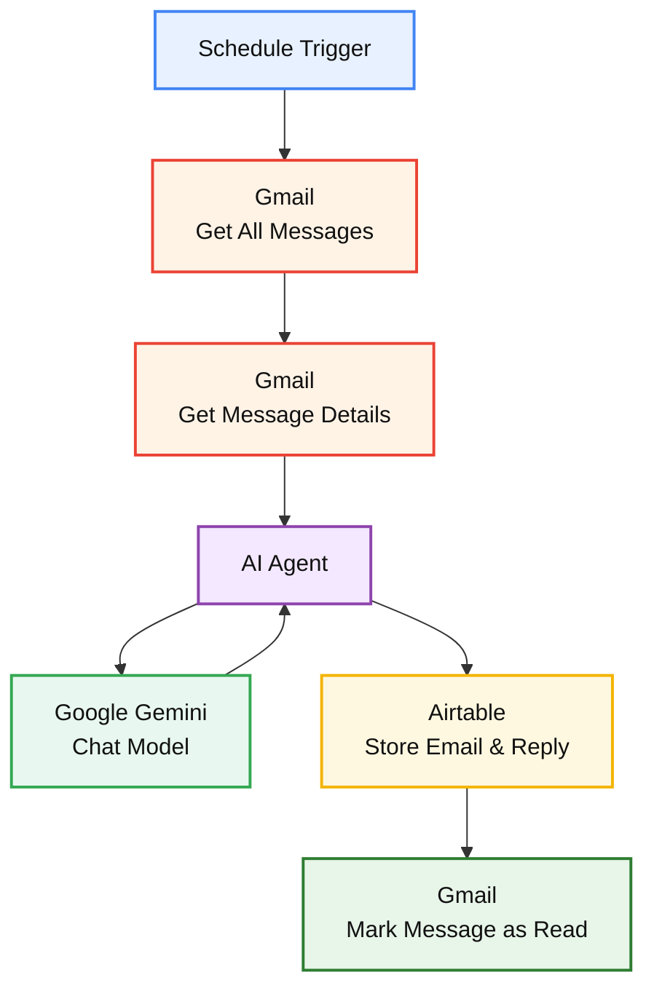
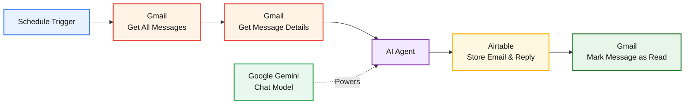
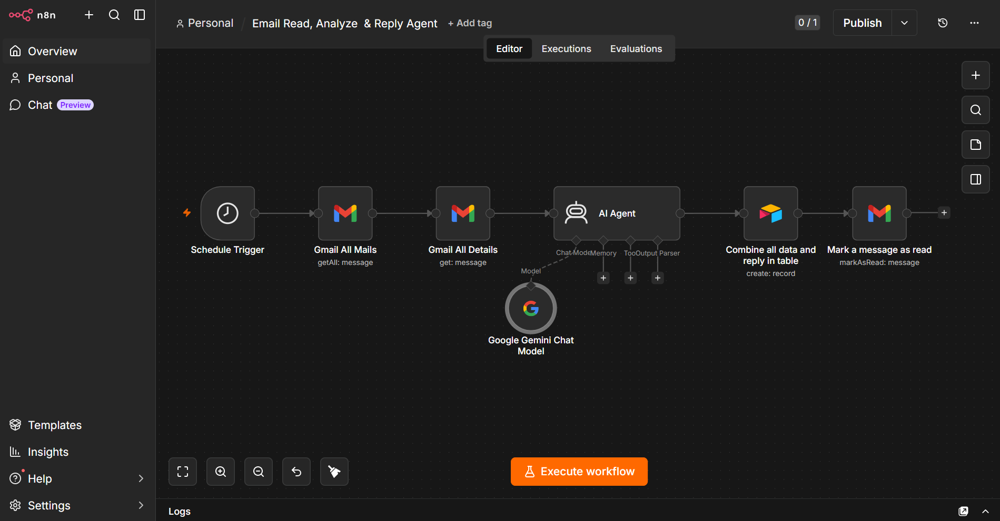

#  n8n Email Read, Analyze & Reply AI Agent

An AI-powered email automation workflow built with **n8n**, **Gmail**, **Google Gemini**, and **Airtable**.

This agent automatically retrieves emails from Gmail, analyzes their content using an AI Agent powered by Google Gemini, generates an appropriate reply, stores the processed information in Airtable, and marks the email as read.

---

##  Overview

Managing emails manually can become repetitive and time-consuming.

This project automates the email processing workflow by combining:

*  Gmail for email retrieval
*  n8n AI Agent for intelligent email analysis and response generation
*  Google Gemini Chat Model for AI-powered processing
*  Airtable for storing email and reply information
*  Schedule Trigger for automated execution

The workflow is designed to create a simple automated pipeline for reading, understanding, and responding to emails.

---

##  Features

* Automatically triggers on a scheduled basis
* Retrieves emails from Gmail
* Fetches detailed email information
* Uses an AI Agent to analyze email content
* Generates an intelligent email reply using Google Gemini
* Stores processed email and reply information in Airtable
* Marks processed emails as read
* Reduces repetitive manual email processing
* Combines workflow automation with generative AI

---

##  Workflow Architecture

The workflow automates the complete email processing pipeline from email retrieval to AI-powered response generation and data storage.



###  Workflow Flow

**Schedule → Gmail → Email Details → AI Agent ↔ Gemini → Airtable → Mark as Read**

---

##  How It Works

### 1.  Schedule Trigger

The workflow starts automatically using the **Schedule Trigger**.

This allows the agent to periodically check for emails without requiring manual execution.

---

### 2.  Gmail - Get All Messages

The Gmail node retrieves available email messages from the mailbox.

This provides the workflow with the emails that need to be processed.

---

### 3.  Gmail - Get Message Details

The workflow retrieves detailed information about the selected email message.

This allows the AI Agent to work with the actual email content and relevant message information.

---

### 4.  AI Agent

The email information is passed to the **n8n AI Agent**.

The agent is responsible for understanding the email content and determining an appropriate response.

The AI Agent is connected to a language model for intelligent processing.

---

### 5.  Google Gemini Chat Model

The AI Agent uses the **Google Gemini Chat Model** as its underlying language model.

Gemini processes the email content and generates the required response based on the instructions provided to the agent.

---

### 6.  Airtable

After the email is analyzed, the workflow stores the relevant information and generated reply in Airtable.

This provides a structured record of processed emails and their responses.

---

### 7.  Mark Message as Read

Once the email has been processed, the Gmail node marks the message as read.

This helps prevent the same email from being treated as a new unread message during future workflow executions.

---

#  AI Agent Capabilities

The AI Agent is designed to help with:

* Understanding incoming email content
* Analyzing the context of messages
* Identifying what the sender is asking for
* Generating relevant replies
* Automating repetitive email-processing tasks
* Passing structured information to the next workflow step

---

#  Technologies Used

| Technology        | Purpose                                                         |
| ----------------- | --------------------------------------------------------------- |
| **n8n**           | Workflow automation and AI Agent orchestration                  |
| **Gmail**         | Email retrieval and message management                          |
| **Google Gemini** | Large language model for email analysis and response generation |
| **Airtable**      | Storage of processed email and reply information                |

---

#  Workflow Components

The workflow contains the following major components:



###  Component Relationship

* **Schedule Trigger** starts the automation.
* **Gmail** retrieves and provides email information.
* **AI Agent** analyzes the email and generates the required response.
* **Google Gemini** powers the AI Agent's language processing.
* **Airtable** stores the processed email and generated reply.
* **Gmail** marks the processed message as read.

---

#  Setup

## Prerequisites

Before running the workflow, you need:

* An n8n instance
* A Gmail account
* A Google Gemini API connection
* An Airtable account
* The required n8n credentials configured

---

## 1.  Import the Workflow

Import the workflow JSON file from this repository into your n8n instance.

The workflow file is located at:

```text
workflow/email-ai-agent.json
```

### Repository

**Email-Read-Analyze-Reply-Agent**

After importing the workflow, configure the required credentials and connections in n8n.

---

## 2.  Configure Gmail

Connect your Gmail account to the Gmail nodes.

Make sure the required permissions are granted for:

* Reading messages
* Accessing message details
* Marking messages as read

---

## 3.  Configure Google Gemini

Connect Google Gemini to the AI Agent through the **Google Gemini Chat Model** node.

Do not expose your API key or credentials inside the GitHub repository.

---

## 4.  Configure Airtable

Connect your Airtable account and configure the destination table.

The table can be used to store information such as:

```text
Email
Sender
Subject
Message
AI Analysis
Generated Reply
Processing Status
Timestamp
```

Adjust the fields according to your workflow configuration.

---

## 5.  Configure the Schedule

Set the Schedule Trigger according to how frequently you want the workflow to check for new messages.

For example:

```text
Every 15 minutes
Every 30 minutes
Every hour
```

Choose the schedule that fits your use case.

---

#  Workflow Preview




---

#  Use Cases

This workflow can be adapted for:

* Personal email automation
* Customer support
* Business inquiries
* Lead management
* Email triage
* Automated email responses
* Internal communication workflows
* AI-assisted inbox management

---

#  Future Improvements

Possible future enhancements include:

* Add email classification
* Detect urgent messages
* Categorize emails automatically
* Add human approval before sending replies
* Add Slack or Telegram notifications
* Add CRM integration
* Store conversation history
* Add sentiment analysis
* Add spam detection
* Improve response personalization
* Add monitoring and error handling

---

#  What I Learned

Building this project provided practical experience with:

* n8n workflow automation
* AI Agent workflows
* Large Language Models
* Google Gemini integration
* Gmail automation
* Airtable data storage
* API and credential management
* AI-assisted email processing
* Connecting multiple services into an automated pipeline

---
