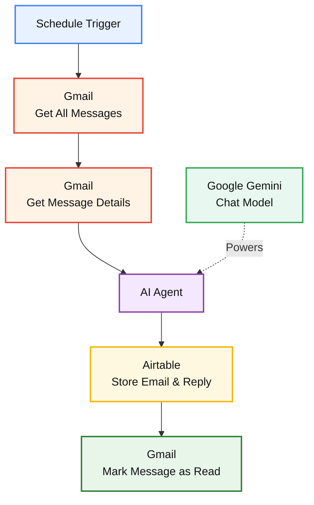

# System Architecture

The Email Read, Analyze & Reply AI Agent consists of multiple connected automation components.

## Architecture

## Data Flow

1. The schedule trigger starts the workflow.
2. Gmail messages are retrieved.
3. Detailed message information is collected.
4. The AI Agent processes the email.
5. Google Gemini generates the AI response.
6. The email information and reply are stored in Airtable.
7. The processed Gmail message is marked as read.
